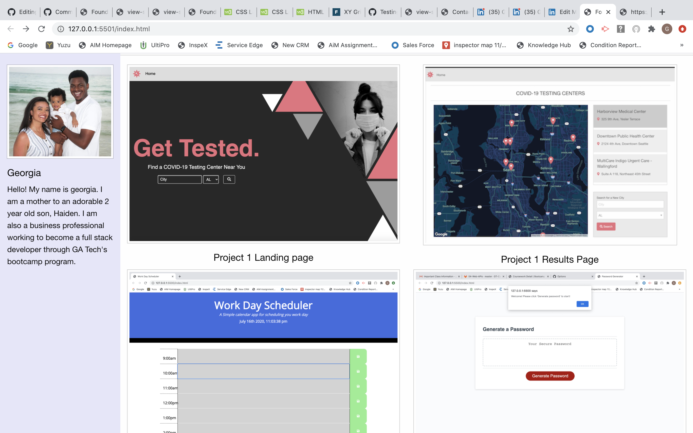

# Portfolio
Portfolio is an application that showcases some of my recent work, provides informaiton about me and provides ways users can get it touch with me.

##Description
Upon entering into the portfolio application, users can see screen shots of the recent work I have done, users can read about me, and see ways in which to contact me. This applicaton has four main features: About me, Portfolio, and links to contact me.

###About Section
Provides users with some information about me with a photo.

###Portfolio Section
A showcase of my most recent projects.

### Contact Section
Provides the user with a way to contact me directly.

##Visuals

 
##Link to Deployed Application
https://gmilteer.github.io/Portfolio/

##Future Developments
1. Get links incorporated to the projects
2. Get contact section linked to my email so I can recieve messages.
3. Add more content.
4. Style it more.